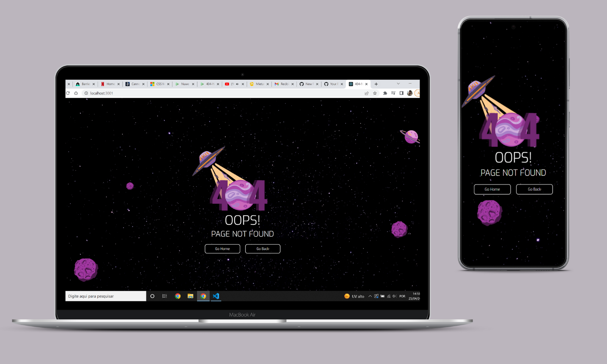
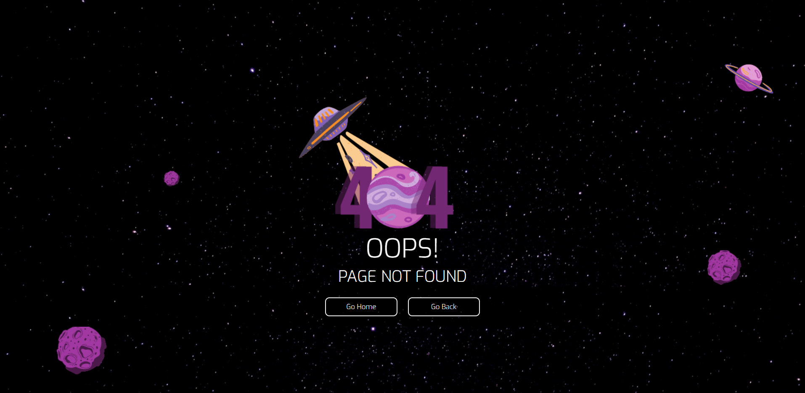
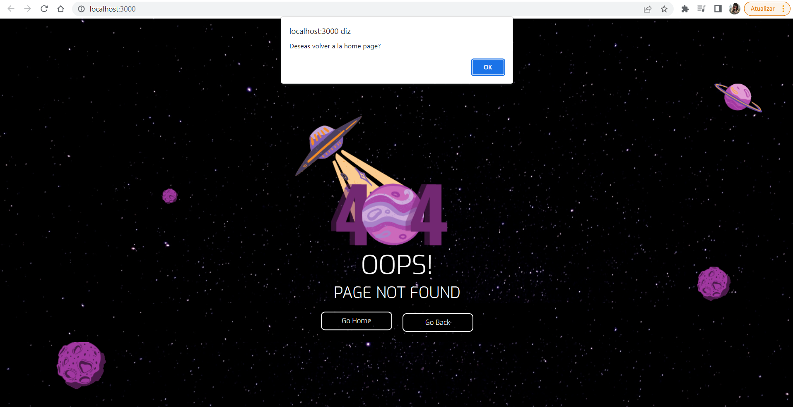
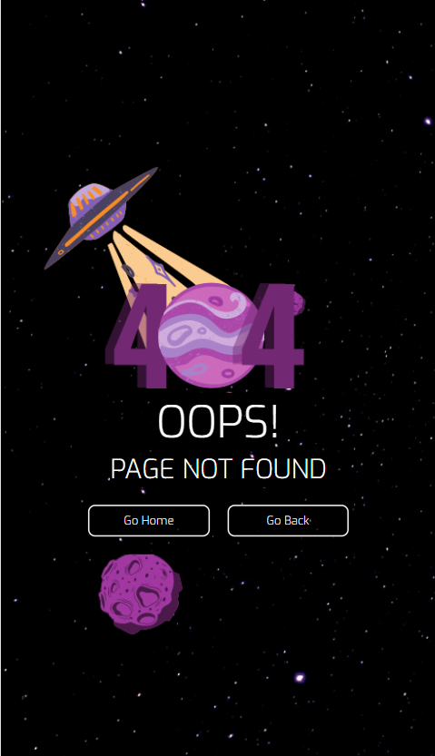

# 
 Challenge Front-End by Nuwe 

<strong> Challenge proposed by <strong><a href="https://nuwe.io">Nuwe</a>

  
### 
About the Challenge

Building a page <strong> "404 Not Found" </strong> with two buttons. It is a starter project that would help solidify basic concepts like State, Components, Virtual DOM, JSX, CSS and UX.  

### The requested are:
* Buttons to let *"Go Home"* and *"Go Back"* the task;
* Design responsive;
* UX Design is free to build;
  

## 
Overview

  

  
* I choose the UX with refes from "Aliens", purple colors;  
* Accessibility buttons "On Click";
* Alert messages;    
  
  

* Alert "Go Home": *Deseas volver a la home page?* ;
* Alert "Go Back": *Deseas volver a tu perfíl?* ; 
  
### Responsive:

    
  
* @Media 400px - 780px;
  
>## Technology Development

* JSX
* React
* DOM
* CSS3 - Flexbox
* UX/UI

>## Author
*Janaina Bazete (My nickname is Nina).*

**We can talk in my <a href="https://www.linkedin.com/in/janainabazete/">LinkedIn</a>**
  
  
 
